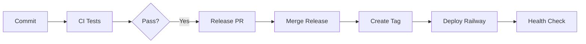

# Workshop Setup Guide

## Para Estudantes: Como configurar Railway

### 1. Dar fork no projeto base (GitHub)
1. Vá em https://github.com/zoedsoupe/scti-2025-status-api
2. Clique em Fork no menu a direita

### 2. Rodar localmente
1. Clonar o seu repositório https://github.com/<seu-usuario>/scti-2025-status-api
2. Entrar no diretório e rodar `make docker-run`
3. Abrir outro terminal e rodar `make curl route="/info"`, deve retornar versão `0.1.0`

### 3. Railway
1. Acesse https://railway.app
2. Clique em "Login with GitHub"
3. Autorize Railway no seu GitHub e no repositório que você deu fork
4. Faça o primeiro deploy
5. Gere uma URL na aba "Settings" do seu app
6. Acesse essa URL, caminho `/`, `/info` e `/health`

### 4. Testar o setup
1. Faça um commit com: `feat: teste de deploy` localmente
2. Merge o PR que release-please criar
3. Deploy automático acontecerá!
4. Recarregue a página do seu projeto e a versão da rota `/info` deve ter sido alterada automaticamente!

## Pipeline Completa



## Comandos Úteis

```bash
# Testar localmente
make docker-run
make curl route="/health"

# Ver workflows (precisa da CLI do github)
# https://cli.github.com/
gh workflow list
gh run list

# Ver Railway (precisa da CLI do railway)
# https://docs.railway.com/guides/cli
railway status
railway logs
```

## Troubleshooting

### CI falha
- Verifique `mix format --check-formatted`
- Rode `mix test` localmente

### Release-please não cria PR
- Use conventional commits: `feat:`, `fix:`, `chore:`
- Commit deve estar na branch main
