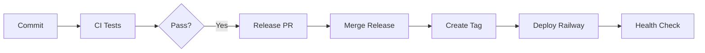

# Workshop Setup Guide

## Para Estudantes: Como configurar Railway

### 1. Criar conta no Railway
1. Acesse https://railway.app
2. Clique em "Login with GitHub"
3. Autorize Railway no seu GitHub

### 2. Configurar Railway Token
1. Vá em Settings -> Tokens
2. Clique em "Create New Token"
3. Nome: `workshop-devops`
4. Copie o token

### 3. Adicionar token no GitHub
1. No seu fork, vá em Settings -> Secrets and variables -> Actions
2. Clique "New repository secret"
3. Name: `RAILWAY_TOKEN`
4. Value: cole o token copiado do Railway

### 4. Testar o setup
1. Faça um commit com: `feat: configura railway`
2. Crie uma PR no github
3. Merge o PR que release-please criar
4. Deploy automático acontecerá!

## Pipeline Completa



## Comandos Úteis

```bash
# Testar localmente
make docker-run
make curl route="/health"

# Ver workflows (precisa da CLI do github)
# https://cli.github.com/
gh workflow list
gh run list

# Ver Railway (precisa da CLI do railway)
# https://docs.railway.com/guides/cli
railway status
railway logs
```

## Troubleshooting

### CI falha
- Verifique `mix format --check-formatted`
- Rode `mix test` localmente

### Deploy falha
- Verifique se RAILWAY_TOKEN está configurado
- Confirme que o Dockerfile está correto

### Release-please não cria PR
- Use conventional commits: `feat:`, `fix:`, `chore:`
- Commit deve estar na branch main
